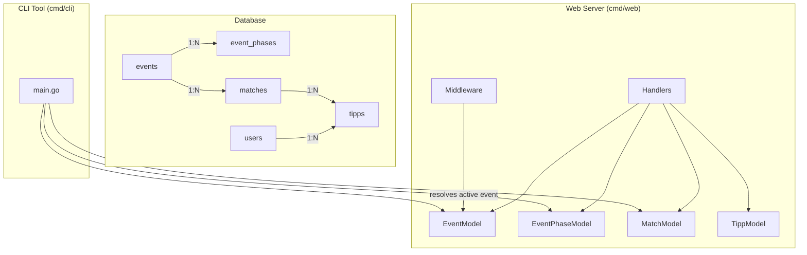
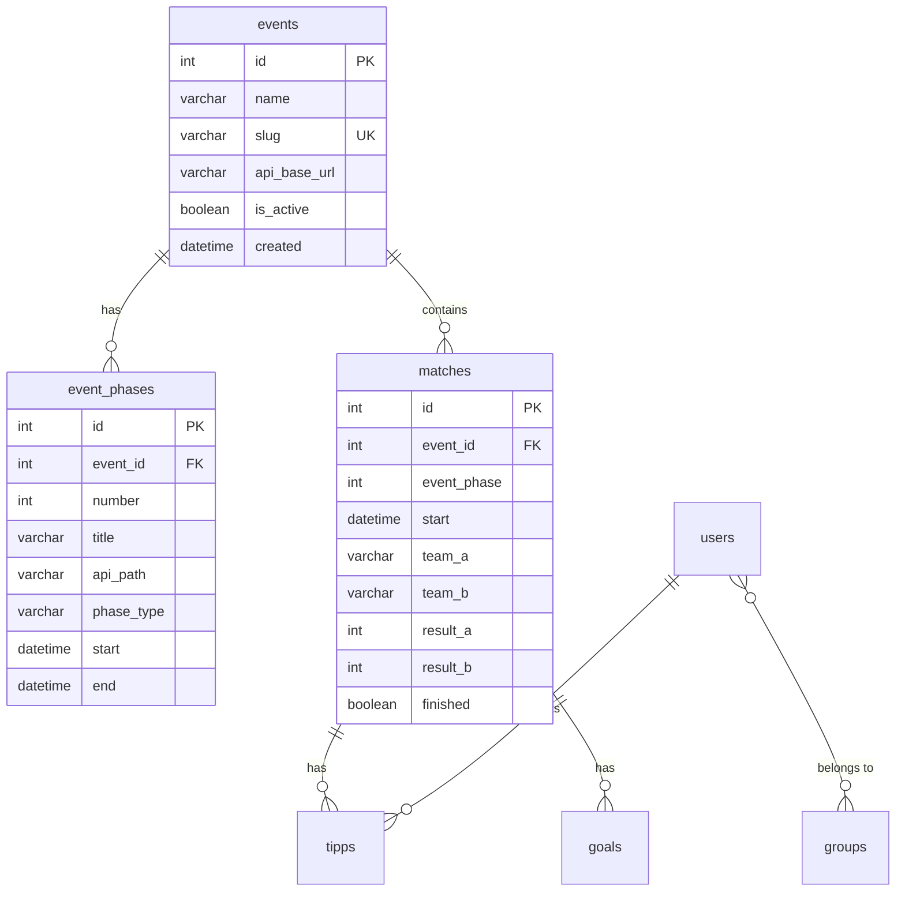

# Design Document: Multi-Tournament Support

## Overview

This design transforms the go-tipp application from a single-tournament system (hardcoded for Euro 2024) into a multi-tournament platform. The core change introduces an `events` table and an `event_phases` table in the database, links matches to events via a foreign key, and scopes all queries (matches, tipps, leaderboards, scoreboard) to the "active event." Historical events remain accessible in read-only mode via a URL query parameter.

The design preserves the existing architecture (server-rendered HTML, session-based auth, MySQL, dbmate migrations) and avoids introducing new frameworks or libraries. Changes are additive — existing data is migrated in-place with no loss.

## Architecture



### Key Architectural Decisions

1. **Active event resolved once per request via middleware** — A new middleware reads the `?event=<slug>` query parameter (or falls back to the DB-active event) and stores the resolved `Event` in the request context. All downstream handlers read from context rather than querying the DB independently.

2. **Event phases stored in DB, not code** — The hardcoded `Phases` variable in `events.go` is replaced by database rows. The `EventPhaseModel` provides the same lookup functions (`GetByNumber`, `DetermineCurrentPhase`) but backed by SQL.

3. **Single migration file** — One dbmate migration creates both new tables, inserts seed data for Euro 2024, adds the `event_id` FK to `matches`, and backfills existing rows. The rollback drops everything cleanly.

4. **Scoring joins event_phases at query time** — The `UpdatePoints` SQL joins `matches` → `event_phases` to determine `phase_type` dynamically, eliminating the hardcoded phase-number ranges in `buildUpdatePointsQuery`.

5. **Read-only mode for non-active events** — When viewing a historical event, tipp input fields are hidden in templates and the server rejects any POST to `/tipp/update` for non-active event matches.

## Components and Interfaces

### New Model: `EventModel` (`internal/models/events.go`)

```go
type Event struct {
    ID         int
    Name       string
    Slug       string
    ApiBaseURL string
    IsActive   bool
    Created    time.Time
}

type EventModel struct {
    DB *sql.DB
}

func (m *EventModel) GetActive() (Event, error)
func (m *EventModel) GetBySlug(slug string) (Event, error)
func (m *EventModel) All() ([]Event, error)
func (m *EventModel) Insert(name, slug, apiBaseURL string) (int, error)
func (m *EventModel) SetActive(eventID int) error
```

### New Model: `EventPhaseModel` (`internal/models/event_phases.go`)

```go
type EventPhase struct {
    ID        int
    EventID   int
    Number    int
    Title     string
    ApiPath   string
    PhaseType string // "phase_group" or "phase_ko"
    Start     time.Time
    End       time.Time
}

type EventPhaseModel struct {
    DB *sql.DB
}

func (m *EventPhaseModel) AllForEvent(eventID int) ([]EventPhase, error)
func (m *EventPhaseModel) GetByEventAndNumber(eventID, number int) (EventPhase, error)
func (m *EventPhaseModel) DetermineCurrentPhase(eventID int, now time.Time) (EventPhase, error)
func (m *EventPhaseModel) Insert(ep EventPhase) (int, error)
```

### Modified Model: `MatchModel`

```go
// Match struct gains EventID field
type Match struct {
    // ... existing fields ...
    EventID    int
}

// Modified signatures — accept eventID parameter
func (m *MatchModel) All(eventID int) ([]Match, error)
func (m *MatchModel) AllByDaterange(eventID int, after, before time.Time) ([]Match, error)
func (m *MatchModel) AllMatchesFinished(eventID int) (bool, error)
```

### Modified Model: `TippModel`

```go
// UpdatePoints now joins event_phases for phase_type resolution
func (m *TippModel) UpdatePoints(eventID int) (int, error)

// GetScoreboardData scoped to event
func (m *TippModel) GetScoreboardData(groupIds []int, eventID int) (ScoreboardData, error)
```

### Modified Model: `UserModel`

```go
// Leaderboard queries join through matches to filter by event
func (m *UserModel) GroupLeaderboard(groupID, eventID int) ([]User, error)
func (m *UserModel) GlobalLeaderboard(eventID int) ([]User, error)
func (m *UserModel) GetBestInSelectedPhases(groupID, eventID int, phaseNumbers []int) ([]User, error)
```

### New Middleware: `resolveEvent`

```go
func (app *application) resolveEvent(next http.Handler) http.Handler
```

Reads `?event=<slug>` from the URL. If present, looks up the event by slug. If absent, fetches the active event. Stores the resolved `Event` in request context. Returns 404 if slug is invalid.

### Modified `application` struct

```go
type application struct {
    // ... existing fields ...
    events      *models.EventModel
    eventPhases *models.EventPhaseModel
}
```

### Admin Handlers (new)

```go
func (app *application) adminCreateEvent(w http.ResponseWriter, r *http.Request)
func (app *application) adminCreateEventPost(w http.ResponseWriter, r *http.Request)
func (app *application) adminAddPhase(w http.ResponseWriter, r *http.Request)
func (app *application) adminAddPhasePost(w http.ResponseWriter, r *http.Request)
func (app *application) adminSetActiveEventPost(w http.ResponseWriter, r *http.Request)
```

### CLI Tool Changes

The CLI `main()` function replaces the hardcoded `models.DetermineEventPhase(today)` call with:
1. Query `EventModel.GetActive()` to get the active event.
2. Query `EventPhaseModel.AllForEvent(event.ID)` to get phases.
3. Query `EventPhaseModel.DetermineCurrentPhase(event.ID, now)` to find the current phase.
4. Construct the API URL as `event.ApiBaseURL + phase.ApiPath`.

## Data Models

### New Table: `events`

```sql
CREATE TABLE events (
    id INT NOT NULL AUTO_INCREMENT PRIMARY KEY,
    name VARCHAR(255) NOT NULL,
    slug VARCHAR(255) NOT NULL,
    api_base_url VARCHAR(255) NOT NULL,
    is_active BOOLEAN NOT NULL DEFAULT FALSE,
    created DATETIME NOT NULL DEFAULT CURRENT_TIMESTAMP,
    UNIQUE KEY events_uc_slug (slug)
) ENGINE=InnoDB DEFAULT CHARSET=utf8mb4 COLLATE=utf8mb4_unicode_ci;
```

### New Table: `event_phases`

```sql
CREATE TABLE event_phases (
    id INT NOT NULL AUTO_INCREMENT PRIMARY KEY,
    event_id INT NOT NULL,
    number INT NOT NULL,
    title VARCHAR(255) NOT NULL,
    api_path VARCHAR(512) NOT NULL,
    phase_type VARCHAR(50) NOT NULL,
    start DATETIME NOT NULL,
    end DATETIME NOT NULL,
    FOREIGN KEY (event_id) REFERENCES events(id) ON DELETE CASCADE,
    UNIQUE KEY event_phases_uc_event_number (event_id, number),
    CONSTRAINT chk_phase_type CHECK (phase_type IN ('phase_group', 'phase_ko')),
    CONSTRAINT chk_start_before_end CHECK (start < end)
) ENGINE=InnoDB DEFAULT CHARSET=utf8mb4 COLLATE=utf8mb4_unicode_ci;
```

### Modified Table: `matches`

```sql
-- Add event_id column with FK
ALTER TABLE matches ADD COLUMN event_id INT NOT NULL DEFAULT 1;
ALTER TABLE matches ADD CONSTRAINT fk_matches_event
    FOREIGN KEY (event_id) REFERENCES events(id);
```

### Seed Data (within migration)

```sql
-- Insert Euro 2024 event
INSERT INTO events (name, slug, api_base_url, is_active)
VALUES ('Euro 2024', 'euro-2024', 'https://api.openligadb.de', TRUE);

-- Insert 7 phases for Euro 2024 (event_id = LAST_INSERT_ID())
INSERT INTO event_phases (event_id, number, title, api_path, phase_type, start, end) VALUES
(LAST_INSERT_ID(), 1, 'Gruppenphase 1', '/getmatchdata/em/2024/1', 'phase_group', '2024-06-14 00:00:00', '2024-06-18 23:59:59'),
(LAST_INSERT_ID(), 2, 'Gruppenphase 2', '/getmatchdata/em/2024/2', 'phase_group', '2024-06-19 00:00:00', '2024-06-22 23:59:59'),
(LAST_INSERT_ID(), 3, 'Gruppenphase 3', '/getmatchdata/em/2024/3', 'phase_group', '2024-06-23 00:00:00', '2024-06-28 23:59:59'),
(LAST_INSERT_ID(), 4, 'Achtelfinale',   '/getmatchdata/em/2024/4', 'phase_ko',    '2024-06-29 00:00:00', '2024-07-04 23:59:59'),
(LAST_INSERT_ID(), 5, 'Viertelfinale',  '/getmatchdata/em/2024/5', 'phase_ko',    '2024-07-05 00:00:00', '2024-07-08 23:59:59'),
(LAST_INSERT_ID(), 6, 'Halbfinale',     '/getmatchdata/em/2024/6', 'phase_ko',    '2024-07-09 00:00:00', '2024-07-13 23:59:59'),
(LAST_INSERT_ID(), 7, 'Finale',         '/getmatchdata/em/2024/7', 'phase_ko',    '2024-07-14 00:00:00', '2024-07-14 23:59:59');

-- Backfill event_id on existing matches
UPDATE matches SET event_id = (SELECT id FROM events WHERE slug = 'euro-2024');
```

### Entity Relationship Diagram




## Correctness Properties

*A property is a characteristic or behavior that should hold true across all valid executions of a system — essentially, a formal statement about what the system should do. Properties serve as the bridge between human-readable specifications and machine-verifiable correctness guarantees.*

### Property 1: Exactly One Active Event Invariant

*For any* set of events in the database and any call to `SetActive(eventID)`, after the operation completes, exactly one event in the `events` table SHALL have `is_active = true`, and that event's ID SHALL equal the provided `eventID`.

**Validates: Requirements 4.1, 4.2, 12.6**

### Property 2: Event-Scoped Match Filtering

*For any* set of matches distributed across multiple events, when querying matches by a specific `event_id`, the result set SHALL contain only matches whose `event_id` equals the queried value, and SHALL contain all such matches (no omissions, no leaks from other events).

**Validates: Requirements 3.5, 5.1, 5.4**

### Property 3: Event-Scoped Point Aggregation

*For any* set of tipps linked to matches across multiple events, when computing a leaderboard or scoreboard for a specific event, the total points for each user SHALL equal the sum of points from only those tipps whose associated match belongs to that event — tipps for matches in other events SHALL contribute zero to the total.

**Validates: Requirements 6.1, 6.2, 6.3**

### Property 4: Tipp Rejection for Non-Active Event Match

*For any* tipp submission targeting a match that does not belong to the currently active event, the system SHALL reject the submission and leave the tipps table unchanged.

**Validates: Requirements 7.1, 10.4**

### Property 5: Bulk Tipp Partial Processing

*For any* bulk tipp submission containing a mix of matches from the active event and non-active events, the system SHALL save tipps only for matches belonging to the active event and skip all others, without aborting the entire request.

**Validates: Requirements 7.3**

### Property 6: Phase-Type-Driven Scoring

*For any* finished match with a corresponding `event_phases` row, the points awarded to a tipp SHALL be determined by the `phase_type` of that row: group-phase scoring rules when `phase_type` is "phase_group" and knockout-phase scoring rules when `phase_type` is "phase_ko", using the values from `PhasePointsMap`.

**Validates: Requirements 8.1, 8.2, 8.4**

### Property 7: Phase Selection by Timestamp

*For any* set of non-overlapping event phases (ordered by `number`) and any timestamp `t`, `DetermineCurrentPhase` SHALL return the phase whose `start <= t` and `end >= t`. If no phase contains `t`, it SHALL return an error.

**Validates: Requirements 9.3**

### Property 8: Valid Event and Phase Data Accepted

*For any* event with a name (1–100 characters), a unique slug (1–100 characters, lowercase alphanumeric and hyphens only), and a valid API base URL (1–255 characters), insertion SHALL succeed. For any phase with a valid number (≥ 1), title (1–100 characters), API path (1–255 characters), phase_type in {"phase_group", "phase_ko"}, and start < end, insertion SHALL succeed.

**Validates: Requirements 12.1, 12.4**

### Property 9: Invalid Event and Phase Data Rejected

*For any* event submission with a missing/empty name, an invalid slug format, a missing API base URL, or a duplicate slug, the system SHALL reject the submission with a validation error. *For any* phase submission with start ≥ end, an invalid phase_type, or missing required fields, the system SHALL reject the submission with a validation error.

**Validates: Requirements 12.2, 12.5, 2.4, 2.6**

## Error Handling

| Scenario | Behavior |
|----------|----------|
| No active event in DB on app startup | Log error, exit with non-zero code (Req 4.3) |
| No active event in DB for CLI | Print error message, exit with non-zero code (Req 9.4) |
| No phases configured for active event (CLI) | Print error message, exit with non-zero code (Req 9.5) |
| No phase currently active by timestamp (CLI) | Print message, exit with non-zero code (Req 9.6) |
| Unknown event slug in `?event=` param | Return 404 Not Found (Req 10.5) |
| Match details for match not in active event | Return 404 Not Found (Req 5.3) |
| Tipp submission for non-active event match | Return error message, reject submission (Req 7.2) |
| Duplicate slug on event creation | Return validation error (Req 12.3) |
| Invalid form data on event/phase creation | Return 422 with field-level validation errors (Req 12.2, 12.5) |
| Match with no event_phases row during scoring | Score as 0 points, skip (Req 8.3) |
| FK violation on match insert (invalid event_id) | Return DB error, surface as 500 (Req 3.4) |
| Migration failure (partial) | Transaction rollback, schema unchanged (Req 11.5) |

### Error Handling Strategy

- **Database constraint violations** (FK, unique, CHECK): Caught at the model layer, translated to domain errors (`ErrDuplicateSlug`, `ErrInvalidPhaseType`), surfaced as validation messages in handlers.
- **Missing active event**: Checked at startup (web) and at start (CLI). Fatal — the app cannot function without an active event context.
- **Invalid URL parameters**: Handled in handlers/middleware with early 404 returns.
- **Partial migration failures**: dbmate wraps migrations in transactions by default for MySQL DDL where supported; the migration is written to be idempotent on re-run.

## Testing Strategy

### Unit Tests (example-based)

- Migration smoke tests: verify table structure, seed data, rollback behavior
- FK constraint tests: insert with invalid event_id, verify rejection
- Cascade delete: delete event, verify phases removed
- CLI error scenarios: no active event, no phases, no current phase
- Event slug 404: request with unknown slug
- Match details 404: request match from non-active event
- Active event fallback: no active event → use most recently created

### Property-Based Tests

**Library**: [rapid](https://github.com/flyweight-design/rapid) (Go property-based testing library)

**Configuration**: Minimum 100 iterations per property test.

Each property test references its design document property:

| Property | Test Tag |
|----------|----------|
| Property 1 | `Feature: multi-tournament-support, Property 1: Exactly one active event invariant` |
| Property 2 | `Feature: multi-tournament-support, Property 2: Event-scoped match filtering` |
| Property 3 | `Feature: multi-tournament-support, Property 3: Event-scoped point aggregation` |
| Property 4 | `Feature: multi-tournament-support, Property 4: Tipp rejection for non-active event match` |
| Property 5 | `Feature: multi-tournament-support, Property 5: Bulk tipp partial processing` |
| Property 6 | `Feature: multi-tournament-support, Property 6: Phase-type-driven scoring` |
| Property 7 | `Feature: multi-tournament-support, Property 7: Phase selection by timestamp` |
| Property 8 | `Feature: multi-tournament-support, Property 8: Valid event and phase data accepted` |
| Property 9 | `Feature: multi-tournament-support, Property 9: Invalid event and phase data rejected` |

### Integration Tests

- Full migration up/down cycle on a test database
- CLI end-to-end: seed DB, run CLI, verify it fetches from correct URL
- Web handler integration: create event → add phases → add matches → submit tipps → verify leaderboard

### Test Database Strategy

Property tests and integration tests use a dedicated test MySQL database (configured via `DATABASE_URL_TEST` env var). Each test function sets up its own data and cleans up after, or uses transactions that are rolled back.
